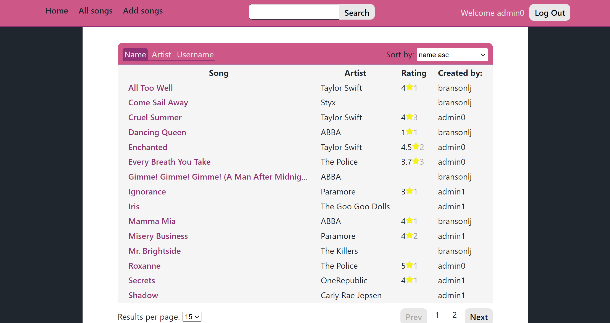
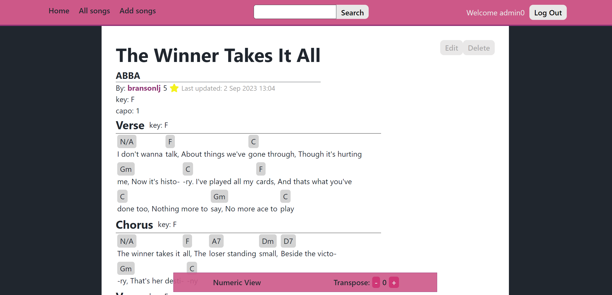
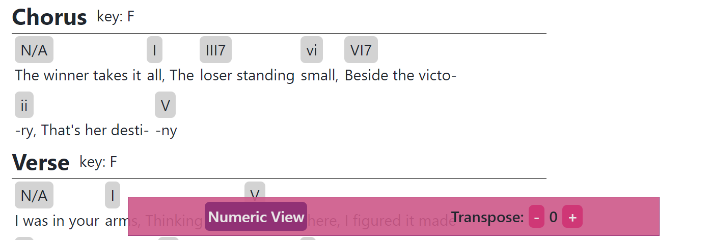
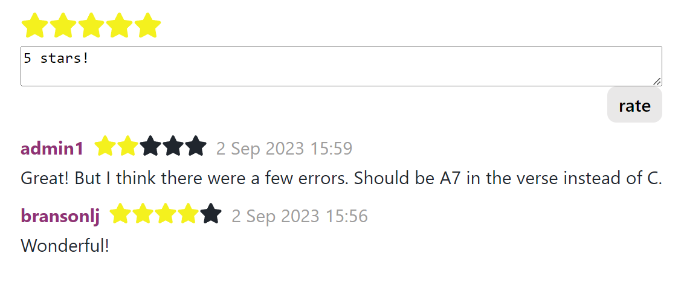

# Chordster

Chordster is a simple web-app that allows users to upload chords for songs, and access songs submitted by other users. This is the ideal app for musicians who want to play along to songs, or analyse their chord structures.

<p align="center">
    
</p>
<p align="center">
    
</p>

## Noteable Features

* Numeric Chords View
    * View chords in their relative numeric for easier analysis of chord structures.

        

* Transpose Chords
    * Easily transpose chords to your desired key to better suit your range of playing.

* Lyrics
    * Attach lyrics to chords and sing along while playing songs.

* Community
    * Rate and comment on other user's songs to provide helpful feedback.
    * [COMING SOON] Suggest edits to other user's songs to help them improve.

        

## How to run

### Locally

To run application on local machine

1. run to install all dependencies 

    ```npm run install:all```

2. then simply run 

    ```npm run dev```

### Docker

Application is fully dockerized, simply run 

```docker-compose up``` 

# Acknowledgements

* The Frontend was made with [React](https://react.dev/), written in TypeScript
* The Backend was made with [Nodejs](https://nodejs.org/en), [Express](https://expressjs.com/)
* Database used: [MongoDB](www.mongodb.com), [Mongoose](https://mongoosejs.com/)